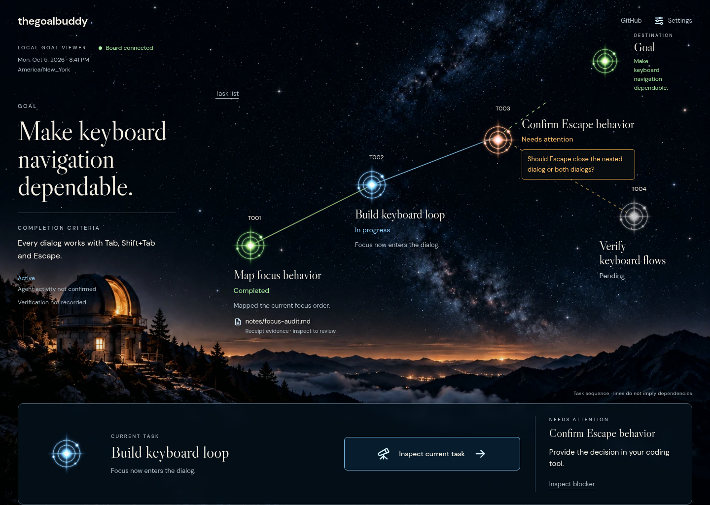

# thegoalbuddy

[Website](https://thegoalbuddy.pete-nektarios.chatgpt.site) · [npm](https://www.npmjs.com/package/thegoalbuddy) · [Source](https://github.com/plgonzalezrx8/thegoalbuddy)

**Keep your goal in sight.**

thegoalbuddy gives long coding runs a destination, a current task, and evidence of progress. Its constellation board helps you see what is moving, what needs attention, and how the work will be verified. Your repository holds the plan; Codex or Claude Code does the work.

<p align="center">
  
  <br>
  
</p>

*Example local board. Your goal files determine the tasks, decisions, and evidence shown.*

This is an MIT-licensed fork of [GoalBuddy by tolimarchuk](https://github.com/tolimarchuk/goalbuddy), revived as **thegoalbuddy**. The original copyright is retained in LICENSE.

## Start Here

**thegoalbuddy 0.5.0 is published on npm.** Open a terminal in the project you want to work on and run the published package with `npx`:

```bash
npx thegoalbuddy@latest
```

Node.js 18 or later and npm (which includes `npx`) are required; a maintained Node 22 or 24 installation is recommended. `npx` downloads the package from npm and runs it; you do not need to clone this repository, install the package globally, or build it. Accept npm’s download prompt if it appears. Codex setup needs a Codex CLI with `codex plugin marketplace` support on your PATH. Claude setup writes its skill, command, and agent files even before Claude Code is installed; install and authenticate Claude Code before executing goals. The package does not supply a coding-tool subscription or unlock native Codex `/goal`.

The default command installs the integration into both Codex and Claude Code. If you use only one tool, select it explicitly:

```bash
npx thegoalbuddy@latest --target codex
npx thegoalbuddy@latest --target claude
```

Restart your coding tool, then prepare a goal:

| Coding tool | Prepare command |
| --- | --- |
| Codex | `$goal-prep` |
| Claude Code | `/goal-prep` |

Tell Goal Prep what you want to accomplish and what observable result will prove it worked. Prep creates the local goal files and prints the exact execution command. Run that command in your coding tool to start the work. **Prep does not start execution automatically.**

Codex uses native `/goal` when your account has that feature. thegoalbuddy does not enable it. Claude Code uses the installed `/goalbuddy` command, leaving Claude's own `/goal` untouched. If native Codex `/goal` is unavailable, use Claude Code or the active-task prompt and your coding tool's normal agent flow; the goal files remain usable.

### Check the installation

Run the check for each tool you installed:

```bash
npx thegoalbuddy@latest doctor --target codex
npx thegoalbuddy@latest doctor --target claude
```

If setup did not complete because a coding tool was missing, install and authenticate that tool, then rerun the matching `--target` installation command. Restart your coding tool after installing or updating the integration.

### Terminal commands and coding-tool commands

Use `npx thegoalbuddy@latest <command>` in your terminal. Use `$goal-prep` or `/goal-prep` inside your coding tool, then run its printed `/goal` or `/goalbuddy` handoff there. The installer prepares the integration; it does not start a goal.

`npx` uses an npm cache for the executable. Installed integrations live in your coding-tool home, while each goal’s `docs/goals/<slug>/` files live in your project. Use the `npx` prefix for terminal commands; this workflow does not add a global `thegoalbuddy` executable to your PATH. `@latest` selects the current published release; use `npx thegoalbuddy@0.5.0` when you want to pin this version.

### Resume an existing goal

```bash
npx thegoalbuddy@latest resume
```

This lists local goals, their active tasks, and the continuation command for each coding tool. Use the printed command to pick up from the files already in your repository. You can begin in Codex and resume in Claude Code, or the other way around.

### Unblock a goal

Open the blocked task and read its reason, stop condition, and receipt. Run `resume` for the correct continuation command, then use that command in your coding tool with the missing decision, access, or evidence. Add a message such as: “Here is the answer to the blocked task: …”. The coding tool updates the goal state and continues from the recorded next step.

The browser board is a **read-only viewer**: it does not approve decisions, edit tasks, or launch the coding agent. Continue the work in your coding tool.

### Migrating from GoalBuddy

Existing `goalbuddy` and `goal-maker` CLI aliases, Claude Code `/goalbuddy`, agent identifiers, v2 state files, `.goalbuddy-board/`, and preference keys remain compatible. New Codex plugin installs use `thegoalbuddy@thegoalbuddy`.

Disable the upstream `goalbuddy@goalbuddy` plugin first to avoid two `$goal-prep` entries. The fork does not automatically remove the upstream plugin; its `goal_*` agent names are shared compatibility identifiers. Use one global npm package at a time because the compatibility CLI names overlap. Installing the fork updates those shared agent files, and its reset removes them; keep one plugin enabled in a given Codex home, or use separate homes for an isolated comparison.

## Cross-Harness Goals

Harnesses churn; repos persist. A thegoalbuddy board lives in your repo as plain files, so the goal outlives whichever tool started it: begin a goal in Codex, resume it in Claude Code tomorrow, or the other way around, using the command for that harness.

```bash
npx thegoalbuddy@latest resume
```

`resume` lists every live board in the repo with its status, active task, and both continuation commands: Codex `/goal Follow docs/goals/<slug>/goal.md.` and Claude Code `/goalbuddy Follow docs/goals/<slug>/goal.md.`. Receipts can record which harness performed each task, so the board's history survives the handoff intact.

Boards can also mix vendors within a single run — a Claude judge and a Codex worker on the same board:

```bash
npx thegoalbuddy@latest dispatch docs/goals/<slug> --to codex
```

`dispatch` renders the active task's prompt, runs the target CLI headless (`codex` or `claude-code`), and returns a receipt with a write-scope report. It requires a Git working tree and compares before/after content, file modes, and index state, including files that were already dirty. Worker changes must stay inside `allowed_files`; read-only roles must change nothing. Authoritative goal control files are protected even when Git ignores them. Scope snapshots cover tracked and non-ignored untracked Git files plus the goal-file trees; other ignored outputs outside those trees are outside this check.

The dispatcher never edits the board. Applying an external dispatch report requires a successful, clean scope check and matching task, board, role, and harness identity. Failed or mismatched reports are rejected before state is written. The PM records the accepted receipt and advances the board. Existing unwrapped manual PM receipts remain supported; external-harness receipts require task and board identity.

## Codex Install Model

For Codex, the canonical install is the native plugin plus bundled agents:

```text
~/.codex/plugins/cache/thegoalbuddy/thegoalbuddy/<version>/
~/.codex/agents/goal_judge.toml
~/.codex/agents/goal_scout.toml
~/.codex/agents/goal_worker.toml
```

The Codex plugin bundles `$goal-prep`; a clean Codex install should not need personal `~/.codex/skills/goalbuddy` or `~/.codex/skills/goal-maker` folders. Native Codex `/goal` is a separate OpenAI-gated feature. thegoalbuddy prepares local boards and handoff prompts for it, but it does not enable or replace native `/goal`.

To verify a Codex install:

```bash
npx thegoalbuddy@latest doctor --target codex --goal-ready
```

To remove thegoalbuddy-owned Codex runtime surfaces:

```bash
npx thegoalbuddy@latest reset --target codex
```

Native `codex plugin remove thegoalbuddy@thegoalbuddy` only removes the native plugin surface. thegoalbuddy also owns the `goal_*.toml` agent files it installed, its Codex plugin cache, its marketplace entry, and old personal skill folders from earlier installs. Use `npx thegoalbuddy@latest reset --target codex` when you want those thegoalbuddy-owned files removed too.

## What It Creates

```text
docs/goals/<your-goal>/
  goal.md
  state.yaml
  notes/
  .goalbuddy-board/ # generated local board files
  subgoals/        # optional depth-1 child boards
```

`goal.md` says what you want.

`state.yaml` tracks the board.

`notes/` keeps longer findings out of the main thread.

`subgoals/` holds optional child boards when one parent task needs a bounded branch of work.

## How It Thinks

```text
Intent -> Oracle -> Surface -> Loop -> Proof
```

The oracle is the observable signal that says whether the original owner outcome is actually true: a test suite, browser walkthrough, demo transcript, generated artifact, benchmark, source-backed answer, release check, or final human decision.

Set this success signal during prep so the final review checks the outcome you actually want.

The local board is the default work surface. It is not an extension marketplace; it is the built-in view of the `state.yaml` truth.

The receipt and task-card format is specified in [docs/spec/receipt-v1.md](docs/spec/receipt-v1.md) — harness-neutral, plain YAML, machine-validated.

Scout maps the repo.

Judge chooses the largest safe useful slice.

Worker completes the whole assigned slice and leaves a receipt.

The execution command keeps the loop honest until a final Judge/PM audit maps receipts and verification back to the oracle and records the full outcome complete.

## Slice Sizing

Safe does not mean small. Safe means bounded, explicit, verified, and reversible.

thegoalbuddy should not optimize for tiny safe tasks. It should optimize for the largest safe useful slice: a working screen, working API path, data pipeline step, backend vertical slice, real bug fix, or milestone review. The board warns when it sees safe-looking work that keeps adding helpers, contracts, proof files, or doc notes without moving the outcome.

## A Small Local Model

thegoalbuddy keeps the model small:

- `state.yaml` is the source of truth.
- A board is a view of one `state.yaml`.
- The local hub is a switchboard for many boards.
- A subgoal is one depth-1 `state.yaml` linked from a parent task.
- Settings are viewer preferences, not workflow state.

Use subgoals for bounded child work that belongs to a parent task. Use multiple local boards when parallel agents or separate goal runs are active at the same time. The constellation view puts your destination and current work first; task details and the conventional board remain available for inspection.

## Execution Quality

thegoalbuddy can prepare safe parallel work; it does not run a parallel org chart or install arbitrary extension packs.

Use `npx thegoalbuddy@latest prompt docs/goals/<slug>` to render a compact prompt for the active task without dumping the whole state file. The prompt includes exact role identifiers for both harnesses: Codex uses `required_spawn_agent_type` (`goal_scout`, `goal_worker`, or `goal_judge`), while Claude Code uses `required_claude_subagent_type` (`goal-scout`, `goal-worker`, or `goal-judge`). PMs should use the exact thegoalbuddy role instead of a generic agent. Use `npx thegoalbuddy@latest parallel-plan docs/goals/<slug>` to inspect read-only or disjoint write-scope work that can be handed to native Codex or Claude Code agent flows. The command reports recommendations only; it does not mutate state or spawn agents.

## Update

When a new thegoalbuddy version ships:

```bash
npx thegoalbuddy@latest update
```

That updates both Codex and Claude Code.

To update just one tool, run `npx thegoalbuddy@latest update --target codex` or `npx thegoalbuddy@latest update --target claude`, then restart that tool. Recheck it with `doctor`. Using `@latest` fetches the current npm release before refreshing the integration; running an older cached or global executable only copies its older payload.

Genuine Claude marketplace plugin installations use `/plugin update thegoalbuddy@thegoalbuddy` instead. The update checker records the acquisition channel so npm-installed Claude skills recommend npm updates.

## Live Boards

After Goal Prep creates a goal, run this in the same project’s terminal, replacing `<slug>` with the goal’s directory name:

```bash
npx thegoalbuddy@latest board docs/goals/<slug>
```

Keep the command running and open the URL it prints to see the plan, active task, receipts, subgoals, and verification status. Stop the viewer with Ctrl+C when finished; the goal files remain in the project.

Multiple local boards reuse one readable `thegoalbuddy.localhost` hub with an in-header board switcher. On a local machine, share the printed URL as a clickable Markdown link. A cloud workspace's `127.0.0.1` or `.localhost` URL points to that workspace, so use the host's supported authenticated preview forwarding or attach screenshots for the user. Keep the board bound to loopback; it is a read-only local viewer. The viewer supports a constellation overview, task details, viewer preferences, and reduced-motion handling.

Custom external integrations should be built as ordinary repo work with a concrete implementation plan, not installed from a thegoalbuddy catalog.

See the [running changelog](CHANGELOG.md) for the complete release history. Version 0.5.0 is the published first fork release. Earlier entries describe upstream releases.

## Good For

- broad project improvements
- release prep
- bug hunts that need evidence
- refactors with verification steps
- anything too large for one prompt

## Develop from TypeScript

All maintained program code, tests, fixtures, and build tools are authored in TypeScript. `.mts` sources generate Node `.mjs` modules; browser `.ts` sources generate `.js`. Generated installable files remain committed so native Git-installed plugins work without a compiler. Edit TypeScript sources, then regenerate runtime and the canonical skill mirror.

From a checkout, use these contributor commands (POSIX shell):

```bash
GOALBUDDY_SKIP_POSTINSTALL=1 npm ci
npm run build
npm run typecheck
npm run check
npm run build:site
```

`npm run check` verifies source, generated output, behavior, branding, and website assets before npm packaging. It does not create an npm tarball or publish. The website export goes to `dist/` for Sites hosting on the assigned Codex subdomain. Goal files stay local; the marketing website does not host your boards. See [CONTRIBUTING.md](CONTRIBUTING.md) for the development boundary and [site hosting](https://github.com/plgonzalezrx8/thegoalbuddy/blob/main/internal/site/DNS.md) for the deployment process.

## For This Repo

thegoalbuddy is MIT licensed. This fork is preparing version 0.5.0. Complete TypeScript, host, browser, hosted website, and independent review checks before building the final npm artifact. Test that exact artifact; publication requires explicit authorization.

The implementation lives in this repo, but the happy path is intentionally tiny: install it, run Goal Prep, then use the printed Codex `/goal` or Claude Code `/goalbuddy` command.

For release process details, see [docs/releases](docs/releases/README.md).

## License

MIT
